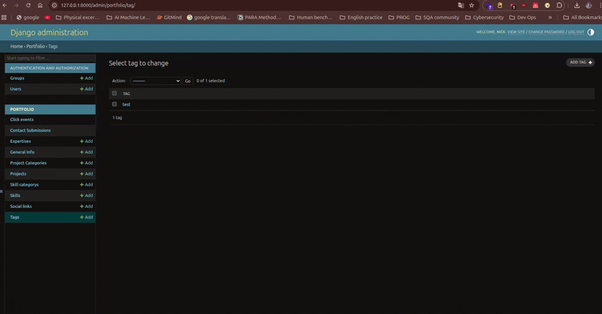

# 🌐 Django Portfolio Website

A professional, data-driven portfolio website built with **Django 5.2.7**.  
This project uses a **Singleton CMS architecture**, enabling full site customization via the Django Admin panel, integrated click analytics, and a high-performance modern UI.

---

## ✨ Key Features

### 🧩 Singleton CMS
- Manage all hero text, about sections, and site-wide copy through a single **General Info** model.
- No hardcoded content — everything is editable from the admin panel.

### 📊 Smart Analytics
- Custom internal tracking for:
  - Resume downloads
  - Project link clicks
- Captures **IP address** and **User-Agent** for each interaction.

### 🎨 Advanced UI
- Fully responsive **Cyberpunk-inspired aesthetic**
- Interactive mouse-glow effects
- SVG icons injected directly from the database for lightning-fast loads
- Dynamic project filtering using **vanilla JavaScript**


---

## 🛠️ Tech Stack

### Backend
- Python 3.11
- Django 5.2.7
- Django REST Framework

### Frontend
- Vanilla JavaScript (ES6+)
- CSS3 (Custom Properties & Keyframes)
- HTML5

### Database
- SQLite (Development)
- PostgreSQL (Production)


## 🚀 Quick Start

### 1️⃣ Installation

```bash
# Clone the repository
git clone https://github.com/MD-Muhiuddin/muhiuddins-portfolio.git
cd portfolio

# Install dependencies
pip install -r requirements.txt

python manage.py migrate
python manage.py createsuperuser
python manage.py runserver
```

## Project Execution

### Web
-

### admin panel
-